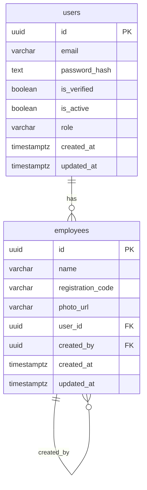

# go-library

REST API built with NestJS for managing a library system with employees, users, and file storage.

## Stack

- **NestJS** + TypeScript
- **PostgreSQL** — main database (TypeORM + migrations)
- **MinIO** — S3-compatible object storage for file uploads
- **JWT** — authentication

## How to run

```bash
# Start dependencies (PostgreSQL + MinIO)
docker compose up -d

# Install dependencies
npm install

# Run migrations
npm run typeorm migration:run

# Start development server
npm run start:dev
```

The API will be available at `http://localhost:3000`.

### MinIO Console
Access the MinIO web console at `http://localhost:9001`  
Default credentials: `minioadmin / minioadmin`

## Modules

- **Auth** — login, JWT token generation
- **Users** — user registration and management
- **Employees** — employee management with photo upload to S3

## ER Diagram



## Environment variables

| Variable | Description |
|---|---|
| `DB_HOST` | PostgreSQL host |
| `DB_PORT` | PostgreSQL port |
| `DB_USER` | PostgreSQL user |
| `DB_PASS` | PostgreSQL password |
| `DB_NAME` | Database name |
| `JWT_SECRET` | JWT signing secret |
| `AWS_ACCESS_KEY_ID` | MinIO access key |
| `AWS_SECRET_ACCESS_KEY` | MinIO secret key |
| `AWS_BUCKET_NAME` | S3 bucket name |
| `AWS_ENDPOINT` | MinIO endpoint URL |
